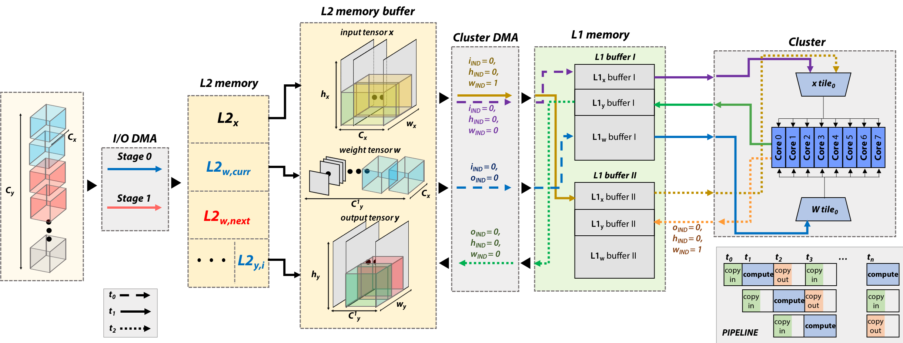
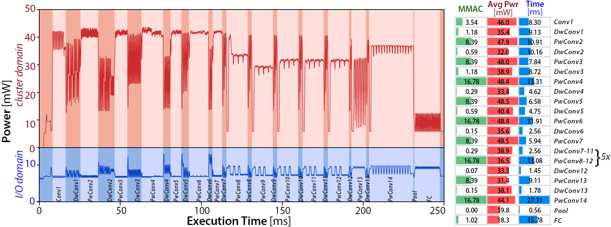

DORY: Deployment ORiented to memorY
===================================

DORY is an automatic tool to deploy DNNs on low-cost MCUs with typically less than 1MB of on-chip SRAM memory. 

### Reference
If you use the DORY tool to deploy your models, please make sure to cite our paper: https://ieeexplore.ieee.org/document/9381618 (preprint available also at https://arxiv.org/abs/2008.07127)
```
@article{burrello2020dory,
  author={A. {Burrello} and A. {Garofalo} and N. {Bruschi} and G. {Tagliavini} and D. {Rossi} and F. {Conti}},
  journal={IEEE Transactions on Computers}, 
  title={DORY: Automatic End-to-End Deployment of Real-World DNNs on Low-Cost IoT MCUs}, 
  year={2021},
  volume={},
  number={},
  pages={1-1},
  doi={10.1109/TC.2021.3066883}
}
```

Highlights
--------
DORY abstracts tiling as a Constraint Programming~(CP) problem: it maximizes L1 memory utilization under the topological constraints imposed by each DNN layer.
Then, it generates ANSI C code to orchestrate off- and on-chip transfers and computation phases.
Layer tiling is depicted in Fig.1.
<p align="center">
  
  <br>
  <em> Fig.1 DORY L3-L2-L1 layer routine example. On the left, the I/O DMA copies weights tile in case only Cy is L3-tiled. Two different buffers are used for L2w. Then, the Cluster DMA manages L2-L1 communication using double-buffering, while the cores compute a kernel on the current tile stored in one of the L1 buffers. </em>
</p>


Platform Supported
------------------
The current platforms supported are GAP8, Diana chip, and Occamy chip (under maintenance). 
For each backend, you have different options:
* GAP8_board: insert limitations for dory calls, which are blocking.
* GAP8_board_L2: it also removes the L3 memory utilization.
* GAP8_gvsoc: no limitations.

* Diana_SoC: generates the whole executable application.
* Diana_TVM: only generates strings to be passed to tvm.

Limitations
-----------
The DORY framework is currently tested on feed-forward networks with single-wire residual connections. NEMO or Quantlab produces the input ONNXs.

You have to set the "v2" chip flag in DORY parameters to use GAP8 v2 boards or v1 boards. Further, you have to flash weights by using the old pulpbridge manually.

Supported layer types
---------------------
* Pointwise Convolution (+ BatchNorm + Relu)
* DepthWise Convolution (+ BatchNorm + Relu)
* Convolution (+ BatchNorm + Relu)
* Max Pooling (+ BatchNorm)
* Average Pooling (+ BatchNorm)
* Add (+ BatchNorm + Relu)
* Linear Layer (+ BatchNorm + Relu)
* Linear Layer 32 bits output -- final layer

All layers are implemented in 8-bit integers, but also in mixed-precision bits (2, 4, 8 bits).
Each specific layer is read from the Frontend by searching from specific patterns in the .onnx graph.

### Quantlab Frontend
* Nodes that are accepted from DORY:

*'Conv', 'Pad', 'Mul', 'Add', 'Div', 'Constant', 'AveragePool', 'GlobalAveragePool', 'MaxPool', 'Cast', 'Clip', 'Floor', 'Flatten', 'Gemm', 'MatMul', 'Shape', 'Gather', 'Unsqueeze', 'Concat', 'Reshape', 'Sigmoid', 'LogSoftmax'*

* Nodes that are accepted and neglected by DORY (their functionality are included in the other nodes. E.g., the out of a conv is automatically flattened before a Fully-connected layer)
 
*'Cast', 'Floor', 'Flatten', 'Shape', 'Gather', 'Unsqueeze', 'Concat', 'Reshape', 'Sigmoid', 'LogSoftmax'*

* Nodes that are not merged and become individual nodes in DORY graph

*'AveragePool', 'MaxPool', 'Conv', 'Gemm', 'MatMul', 'GlobalAveragePool', 'Add'*

* Rules that DORY search in the graph

*'Relu' = 'Mul-Div-Floor-Clip'*  
*'BNRelu' = 'Mul-Add-Div-Floor-Clip'*  
*'Pad' = 'Pad'*

These nodes are searched as consecutive nodes in the onnx graph.  
**BNRelu** and **Relu** are always merge to the previous node of the DORY graph.
**Pad** is always merged to the subsequent node.

Current Issues 
--------------

* 1D Mixed-precision networks: not supported. The 2D mixed-precision kernels are used.

Topology tested
---------------
* MobilenetV1-128
* Custom networks
* MobilenetV1-224 4-8bits
* MobilenetV2-224 4-8 bits
* MobilenetV1-224 8bits
* MobilenetV2-224 8 bits 
* Residual networks 

Requirements
------------

### Backend
The DORY framework can be tested using the gvsoc of GAP8 from GreenWaves.
A detailed guide on installing and setting up the latest version can be found at [link](https://greenwaves-technologies.com/manuals/BUILD/HOME/html/index.html#section7).
The DORY tool is tested using 3.6 Realase of gap_sdk, commit: *c6494b97314470446674bb468d31e4391fb187e9* .

### Python
The framework has been developed using python 3.6.8.
The following packages are needed:
* Mako (1.0.12)
* numpy (1.18.4) 
* onnx (1.10.0)    
* ortools (7.5.7466)

### Input
The framework receives as input:
1. an ONNX quantized network generated with the Nemo tool. Refer to [nemo](https://github.com/pulp-platform/nemo) for Nemo framework installation and execution.
2. an ONNX quantized network generated with Quantlab tool.  
Note that only a standard format 8-bit quantized produced by NEMO/Quantlab can be read given the specific nodes' sequences that are recognized by DORY;  
Examples are given inside [DORY examples](https://github.com/pulp-platform/dory_examples)

Installation
------------
The execution of DORY for 8-bits networks requires the following folders:
1. dory: repository with the framework
2. pulp-nn: repository with backend kernels developed for DORY flow execution

Execute the following commands to clone DORY and pulp-nn backend: 
```
git clone https://github.com/pulp-platform/dory
cd dory
git submodule update --remote --init dory/dory_examples
git submodule update --remote --init dory/Hardware_targets/PULP/Backend_Kernels/pulp-nn
git submodule update --remote --init dory/Hardware_targets/PULP/Backend_Kernels/pulp-nn-mixed
python3 -m pip install -e .
```

Examples
--------
To download the examples built on DORY, clone the internal dory_example submodule (it should be automatically previously downloaded).
Then, you can run one example from the library with the following command:
```
python3 network_generate.py NEMO PULP.PULP_gvsoc ./dory/dory_examples/config_files/config_NEMO_MV1.json --app_dir ./application/
```
Where NEMO is the Frontened used, PULP.PULP_gvsoc the backend (supported by GAP8), ./dory/dory_examples/config_files/config_NEMO_MV1.json the config file.
Note that in the folder logs/, all the intermediate .json and .onnx are generated.

The power profiling on a GAP8 v3 of a 1.0-MobilenetV1-128 is reported in Fig.2.
<p align="center">
  
  <br>
  <em> Fig.2 In the left part, the 1.0-MobileNet-128 power profile when running on GAP-8 @ fc cluster = 100 MHz and VDD = 1V. On the right, number of MAC operations, average power, and time for each layer of the network. Power was sampled at 64 KHz and then filtered with a moving average of 300 micro seconds. </em>
</p>

Building and Using the Dockerfile
-------------------------------------
To build the docker image (mostly used to debug the CI), run the script in the `docker_utils` folder:
```
./docker_utils/build_docker.sh $IMAGE_NAME
```
`$IMAGE_NAME` is an optional argument specifying the target image name. If none is provided, the resulting image will be called "dory_docker".

Likewise, to run a docker container from the built image, run:
```
./docker_utils/run_docker.sh $IMAGE_NAME
```
Once you are in the docker container shell, you can use the setup scripts to set up your environment for `pulp-sdk` or `gap-sdk`:
```
source ./docker_utils/docker_pulp_sdk.sh
```
or
```
source ./docker_utils/docker_gap_sdk.sh
```

Now you can use DORY in the docker image as you wish, e.g., to run the tests:
```
python3 -m pytest test_GAP8.py --compat pulp-sdk
```
To mount additional folders, edit the `run_docker.sh` script and add more `-v` options.

### Contributors
+ **Alessio Burrello**, *University of Bologna*, [email](mailto:alessio.burrello@unibo.it)
+ **Francesco Conti**, *University of Bologna*, [email](mailto:f.conti@unibo.it)
+ **Luka Macan**, *University of Bologna*, [email](luka.macan@unibo.it)
+ **Georg Ruetishauer**, *ETH Zurich*, [email](georgr@iis.ee.ethz.ch)
+ **Thorir Mar Ingolfsson**, *ETH Zurich*, [email](mailto:thoriri@iis.ee.ethz.ch)
+ **Angelo Garofalo**, *University of Bologna*, [email](mailto:angelo.garofalo@unibo.it)
+ **Nazareno Bruschi**, *University of Bologna*, [email](mailto:nazareno.bruschi@unibo.it)
+ **Giuseppe Tagliavini**, *University of Bologna*, [email](mailto:giuseppe.tagliavini@unibo.it)
+ **Davide Rossi**, *University of Bologna*, [email](mailto:davide.rossi@unibo.it)
+ **Luca Benini**, *University of Bologna* and *ETH Zurich*, [email](mailto:luca.benini@unibo.it)

### License
DORY is released under Apache 2.0, see the LICENSE file in the root of this repository for details.
